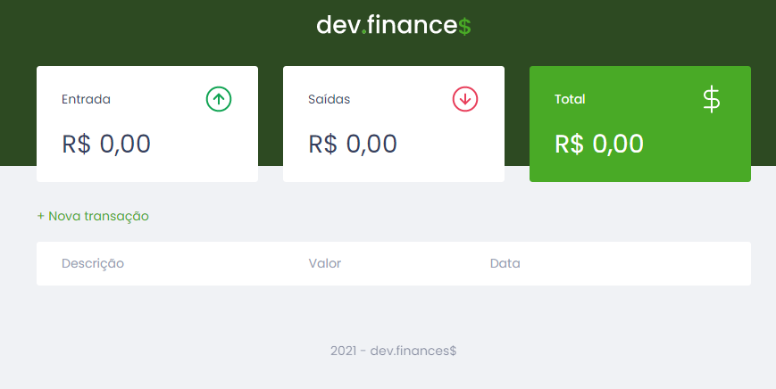

## MARATONA DISCOVER

  

## Um pouco do Projeto:

➡ Projeto desenvolvido na Maratona Discover de Front-End da Rocketseat
➡ Site para gerenciamento de dinheiro, podendo adicionar transações de valores positivos ou negativos e ao final poder receber o resumo das transações somadas e controlar o dinheiro que você ganha e gasta

## Conteúdos

- [Overview](#overview)
  - [Como rodar o projeto](#como-rodar-o-projeto)
  - [Como utilizar](#como-utilizar-o-projeto)
  - [Screenshot](#screenshot)
  - [Links](#links)
- [Processo](#processo)
  - [Contruido com](#construido-com)
  - [Tecnologia utilizadas](#tecnologias-utilizadas)
  - [O que eu aprendi](#oque-eu-aprendi)
  - [Continuação do desenvolvimento](#continuacao-do-desenvolvimento)
- [Autor](#autor)

## Overview

### Como rodar o projeto

 1. Primeiramente é necessário ter o node js instalado, com o node instalado
 2. Clone o projeto com `git clone https://github.com/glsvitoria/maratona-discover`
 3. Após clonar o projeto, no console do seu editor de código digite o seguinte comando `npm install` para instalar todas as dependencias
 4. E em seguida use `npm start` para iniciar o projeto :D

### Como utilizar

 1. Clicar em "nova transação" para poder adicionar valores
 2. Adicionar, a parte do item 1, as suas contas e seu salário mensal
 3. Analisar o quanto você ainda pode gastar esse mês a partir dos seus gasto

### Screenshot

  
### Links
 - Site hospedado: [Dev.finance$](https://glsvitoria.github.io/maratona-discover/)

## Processo

### Tecnologias utilizadas:

### O que eu aprendi

- Criação de um site bonito e funcional
- Utilização com maior frequência do Java Script para todos os cálculos e interações do site

### Continuação do desenvolvimento

- Trabalhar com o back-end em banco de dados para o site poder ser funcional não apenas localmente para cada usuário
- Ter uma página de login para autenticação de conta

## Autor
- Linkedin - [Guilherme Vitória](https://www.linkedin.com/in/glsvitoria/)
- GitHub - [glsvitoria](https://github.com/glsvitoria)
- Instagram - [glsvitoria](https://www.instagram.com/glsvitoria/)
